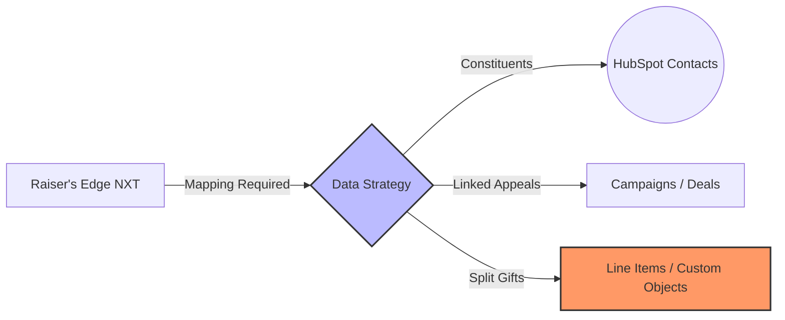

---
tags:
  - client/AAD
  - project/migration
  - system/hubspot
  - system/raisers-edge
  - status/planning
  - type/strategy-doc
date: 2026-01-08
priority: High
---

# [[AmericanDerm]] Account Preparation Strategy

> [!abstract] Executive Summary
> **Client**: AmericanDerm (AAD)
> **Goal**: Modernize fundraising by migrating from **Raiser’s Edge NXT** to **HubSpot**.
> **Key Driver**: Unify Fundraising, Events, and Member data to view the "whole constituent."

## 1. The Strategic Bridge 🌉

The transition hinges on translating *non-profit complexity* into *HubSpot architecture*.

> [!example] Data Model Transformation
> Moving from a rigid, flat record structure to a dynamic, relational deal-based flow.

### 🚧 Critical Transition Points
1.  **Terminology Mapping**: Mapping `Linked Appeals` (Parent/Child) $\to$ HubSpot `Deal` + `Campaign` associations.
2.  **Financial Rigor**:
    *   ==Split Designations==: Handling single gifts across multiple funds (Must sync with **Sage Intacct**).
    *   **Nightly Reconciliation**: Automated batch exports with granular error logging.
3.  **The Membership Gap**:
    *   **Aptify vs. HubSpot**: Defining the **System of Truth** for membership status.
    *   **Self-Service**: *Who hosts the renewal portal?* (See Risks).

## 2. MVP Strategic Priorities 🎯

| Feature | Strategic Importance | Impact |
| :--- | :--- | :--: |
| **Fundraiser Dashboards** | **Adoption Driver**: "Revenue Thermometers" and Task queues to replicate *and improve* RE NXT views. | 🔥 |
| **"Ask" Pipeline** | **Visibility**: Visualizing the flow from *Qualification* $\to$ *Closed Won*. Crucial for forecasting. | 📈 |
| **Member Lifecycle** | **Retention**: Automating specific "Lapse Alerts" based on `Join Date` & `Tier`. | 🔄 |
| **Event Hub** | **Engagement**: Centralizing RSVPs and Sponsorships (replacing disparate sheets). | 🎟️ |

## 3. Operational Risks Map ⚠️

> [!danger] Critical Blockers
> *   **Unselected Event Platform**: "Pending" status blocks integration scoping for attendees/tickets.
> *   **Member Portal Ambiguity**: Request for "Self-Service Renewals".
>     *   *Risk*: Major scope creep if HubSpot CMS is expected to handle auth/payments effectively replacing **Aptify** functionality.
> *   **Legacy Logic Debt**: `Linked Appeals` and `Giving Level` calculations must be ETL'd, not just migrated.
> *   **Governance Void**: Blank **RACI** and **Charter** templates imply undefined decision rights.

## 4. Implementation Readiness Checklist ✅

> [!todo] Immediate Actions
> - [ ] **Tech Access**: Validate API credentials for [[Aptify]], [[Sage Intacct]], and [[Monday.com]].
> - [ ] **Decision**: Force selection of the **Event Platform**.
> - [ ] **Data Architecture**: Draft the `RE NXT` $\to$ `HubSpot` schema map (Focus: *Split Gifts*).
> - [ ] **Governance**: Fill the **RACI** to identify the *real* signer for scope changes.
> - [ ] **Scope Lock**: Confirm **Portal** ownership (External vs. HubSpot Build).

[^1]: Insights derived from "Hubspot Wishlist (1).docx"
[^2]: Risk assessment based on "AAD - RAID Log.xlsx" status
