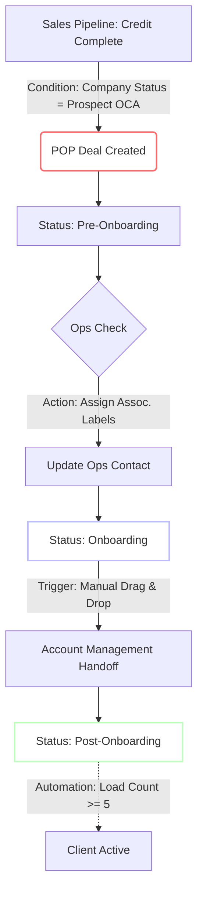

# Traffix Hubspot Training Protocol

> [!abstract] Executive Summary
> This document outlines the official **Hubspot CRM Implementation & Training Protocol** for Traffix, facilitated by Aptitude 8. It moves beyond basic navigation to establish a **Standard Operating Procedure (SOP)** for Sales and Operations handoffs.
> 
> **Core Objective**: Transition from legacy Netsuite dependencies to a generic, scalable Hubspot architecture for **Prospecting**, **Pipeline Management**, and the **POP (Pre-Onboarding, Onboarding, Post-Onboarding) Lifecycle**.

---

## 📑 Module Index

- [[#Module 1: CRMB and User Interface Configuration|Module 1: Core CRM Configuration]]
- [[#Module 2: Sales Workspace & Prospecting Mechanics|Module 2: Sales Workspace Mechanics]]
- [[#Module 3: Deal Pipeline & Revenue Architecture|Module 3: Deal & Revenue Architecture]]
- [[#Module 6: POP Lifecycle (Operations Handoff)|Module 6: The POP Lifecycle]]
- [[#Module 7: Analytics, Admin & Integrations|Module 7: Analytics & Admin]]

---

## Module 1: CRMB and User Interface Configuration

### 1.1 Global Navigation Strategy
*   **Object Architecture**: Understanding the hierarchy of **Standard Objects** (Contacts, Companies, Deals) vs. **Custom Objects** (RFPs).
*   **Bookmarks Bar**: Configuring the top navigation for high-frequency tools (`Sales > Sales Workspace`, `CRM > Contacts`).
*   **Portal Defaults**:
    *   Setting the **Default Dashboard** (Leadership vs. Individual Contributor).
    *   Configuring **User Preferences** (`Settings > General`) for timezone and notification digests.

> [!tip] Certification Insight: The "Golden Path"
> Start every session by defining **Records** vs. **Objects**.
> - **Object**: The database table (e.g., "Contacts").
> - **Record**: The single row data (e.g., "Danny Velt").
> - **Property**: The field (e.g., "Email Address").

### 1.2 View Customization
*   **Column Management**: Using `Actions > Edit Columns` to surface high-value properties (e.g., *Last Contacted Date*, *Lead Status*) in the list view.
*   **Preview Sidebar**: Customizing the "About this Contact" section to ensure reps see critical data without opening the full record.

---

## Module 2: Sales Workspace & Prospecting Mechanics

### 2.1 The Sales Command Center
Danny emphasized the **Sales Workspace** (`Sales > Sales Workspace`) as the "single pane of glass" for daily productivity.

- **Task Queues**: Utilizing the **Start Tasks** feature to run through a sequential "Queue" of calls and emails without navigating back to the list.
- **Activity Logging**:
    - **Manually Logged**: Notes, one-off emails.
    - **Automatically Logged**: Emails (via Outlook/Gmail integration), Calls (via Dialpad), Meetings (via Calendar sync).

### 2.2 Advanced Segmentation (Filters)
Prospecting efficiency relies on **Smart Views**.

| Filter Type | Functionality | Best Practice |
| :--- | :--- | :--- |
| **Quick Filters** | One-click segmentation (e.g., "My Deals") | Use for daily checks. |
| **Advanced Filters** | Boolean Logic (`AND`/`OR`) | Use for "Tier 1 Prospects in Chicago" (`City = Chicago` AND `Tier = 1`). |
| **Saved Views** | Sticky tabs in the workspace | Create standard views for "Stalled Leads" (>30 days inactivity). |

> [!example] Workflow: Breeze Intelligence
> Use the **Breeze** tab on the right sidebar to enrich company data (employee count, revenue) automatically, reducing manual data entry for reps.

---

## Module 3: Deal Pipeline & Revenue Architecture

### 3.1 Pipeline Physics
Understanding the mathematical impact of **Deal Stages**.

*   **Weighted Forecast**: Calculated as `Total Amount * Stage Probability`.
    *   *Example*: A $100k Deal in **Negotiation** (50%) = $50k Weighted Forecast.
*   **Dependent Properties**:
    *   **Gated Stages**: Moving a deal from *Solution Design* to *Proposal* triggers a modal requiring specific data points (e.g., "Proposal Date"). This promotes data hygiene.

### 3.2 The Deal Board & Metrics
Danny demonstrated the hidden **Metrics** drawer on the Kanban board.

*   **Visual Management**: Drag-and-drop mechanics.
*   **Metrics Toggle**: Clicking the small `Metrics` button (bottom-left of the "Add Deal" CTA) reveals:
    *   *Total Pipeline Value*
    *   *Weighted Pipeline Value*
    *   *Average Deal Age*

### 3.3 The RFP Object
A **Custom Object** handling the Request for Proposal workflow.
*   **Trigger**: Checking `RFP Required = True` on a Deal Record.
*   **Association**: Automatically links the RFP record back to the parent Deal and Company.

---

## Module 6: POP Lifecycle (Operations Handoff)

> [!warning] Critical Workflow
> The **POP (Pre-Onboarding, Onboarding, Post-Onboarding)** process is the operational bridge. It is distinct from the Sales Pipeline.

### Process Flow Diagram

### Key Technical Mechanics
1.  **Association Labels**: Defining specific roles on the Company Record (e.g., *Operations Contact* vs. *Billing Contact*) using Hubspot's flexible association schema.
2.  **The Manual Gate**: The move from `Pre-Onboarding` to `Onboarding` is the **only manual manual trigger** in this sequence, forcing a human checkpoint before implementation begins.
3.  **Fabric Integration**: The transition to `Post-Onboarding` relies on the "Load Count" property syncing from Netsuite (via Fabric) to Hubspot.

---

## Module 7: Analytics, Admin & Integrations

### 7.1 CTI Integration: Dialpad
Danny successfully demoed the **CTI (Computer Telephony Integration)** with Dialpad.

*   **Green Light Indicator**: The phone icon in the top right changes state to indicate active integration.
*   **Call Object**: Calls acts as standard objects, storing:
    *   *Outcome* (Connected, Voicemail)
    *   *Disposition*
    *   *Recording URL*

### 7.2 Sales Analytics Suite
Located under `Reports > Analytics Tools > Sales Analytics`.

*   **Waterfall Reports**: Visualizing the "leakage" in the pipeline (where deals drop off between stages).
*   **Coach Reps**: Leveraging "Call Outcome" reports to see if a rep has an abnormally high "Connected" vs. "Meeting Booked" ratio.

### 7.3 Dashboard Governance
*   **Permissioning**:
    *   **Private**: Visible only to creator.
    *   **Team**: Visible to specific Hubspot Teams (e.g., "US Sales").
    *   **Public**: Visible to all portal users.
*   **Filtering**: Using dashboard-level filters (`Date Range`, `Owner`) to manipulate all reports on the canvas simultaneously without editing the underlying reports.

> [!success] User Adoption
> Admins should monitor the **User Adoption Dashboard** to track:
> - *Last Login Date*
> - *Tasks Completed vs. Assigned*
> - *Sequences Enrolled*
