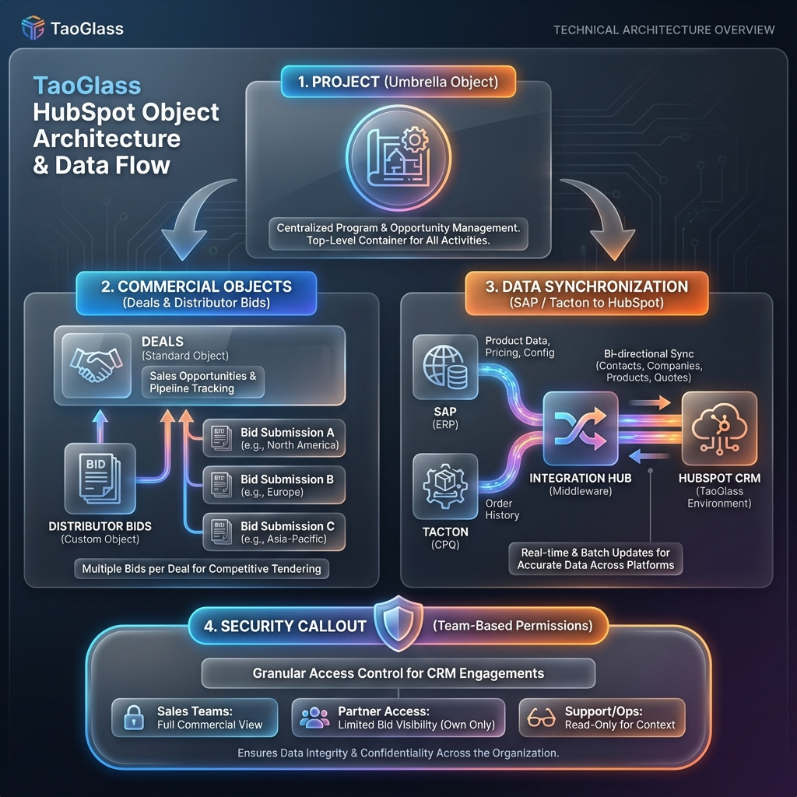

# TaoGlass HubSpot Object Architecture & Data Flow

## Architectural Breakdown

### 1. The Project Umbrella (Top-Level Custom Object)
- **Purpose:** Acts as the centralized "Source of Truth" container for all related activity.
- **Function:** Groups multiple commercial opportunities (Deals) under a single project lifecycle.
- **Benefit:** Ensures global visibility for projects that span multiple regions, products, or distributors.

### 2. Commercial Objects (Deals & Distributor Bids)
- **Deals (Standard Object):** Used for primary sales opportunity tracking, pipeline management, and financial forecasting.
- **Distributor Bids (Custom Object):** 
    - **The Multi-Distributor Solution:** Solves the technical limitation in Tacton where changing a distributor overwrites data.
    - **Relationship:** 1 Deal : many Bids.
    - **Outcome:** Allows capturing quotes from 3+ distributors for a single deal without duplicating deal records in HubSpot.

### 3. Data Synchronization (SAP / Tacton Integration)
- **SAP (ERP):** Single source of truth for inventory, product metadata, and final financial data.
- **Tacton (CPQ):** The configuration engine. New part numbers originate here, sync to SAP, and then to HubSpot.
- **Integration Hub:** Middle-tier automation manages the flow of product data, pricing, and order history into HubSpot.
- **Philosophy:** Avoid full bidirectional sync to prevent data conflicts; focus on providing Sales reps with finished product data for visibility.

### 4. Security & Permissions (Engagements)
- **Team-Based Ownership:** Strict permissioning for "Engagements" (Notes, Calls, Meetings, Tasks).
- **Protection:** Prevents sensitive Aerospace & Defense (A&D) conversations from being visible to non-authorized staff.
- **Implementation:** Leverages HubSpot's granular team-based restrictions to ensure data integrity and confidentiality across global teams.

---
*Generated by Antigravity AI on January 7, 2026.*
